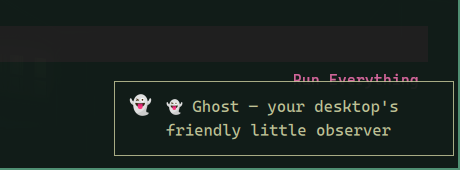

<div align="center">

# 👻 Ghost

**A tiny ghost in the corner of your Omarchy desktop. Sometimes it says boo.**

That's it. It does not help. It does not want a reply. Click it and it goes away.



*"boo."*

</div>

---

Ghost lives in the bottom-right corner. While you look at a window, it
occasionally peeks in — usually `boo.` — and fades out. Rarely it mentions
a workspace that's been sitting open, or a weekly recap. No reply box.
Click it and it goes away.

Everything runs locally. 90 days of usage stay in
`~/.local/state/omarchy/ghost/state.json`.

## Features

| | |
|---|---|
| 👻 **Vibes** | short deadpan lines. mostly `boo.` |
| 📊 **Remembers** | app minutes, 90 days, daily / weekly / monthly recap |
| 🪟 **Notices** | workspaces sitting open that you haven't looked at |
| 🤫 **Quiet** | no focused window, quiet hours (01–07), cooldowns |
| 🔒 **Local** | state file only. nothing leaves the machine |

## Install

```sh
omarchy plugin add https://github.com/SemihMutlu07/omarchy-ghost.git --enable
```

No restart needed — the shell hot-reloads. First run writes
`~/.config/omarchy/ghost.json` with defaults.

## Configure

Edit `~/.config/omarchy/ghost.json` (hot-reloads on save). All keys:

```jsonc
{
  "enabled": true,
  "minIntervalSec": 180,        // floor between messages
  "maxIntervalSec": 720,        // ambient boo lands in [min, max]
  "variantCooldownSec": 1800,   // don't reuse a line within this window
  "quietHoursStart": 1,         // 01:00 …
  "quietHoursEnd": 7,           // … 07:00: ambient/focus/window/workspace go quiet
  "idleSeconds": 600,           // no focused window this long = you're away
  "whisperDurationSec": 6,
  "brain": "templates",         // "templates" | "llm"
  "llmCommand": "",             // optional custom command (prompt appended)
  "maxWidth": 340,
  "insightDailyCap": 6,         // max metric insights per day
  "chances": {                  // per-event likelihood (0–1)
    "focus": 0.12, "window": 0.4, "workspace": 0.4,
    "fullscreen": 0.8, "longSession": 0.5, "lateNight": 1.0,
    "title": 0.5, "unexpected": 0.5, "insight": 0.6
  }
}
```

### LLM brain

With `"brain": "llm"`, Ghost hands the event context to `bin/ghost-llm` and
uses its one-line answer, falling back to templates when the model is slow,
unauthenticated, or missing. Engines tried in order: `$GHOST_LLM_COMMAND`,
`claude -p`, `ollama` (`GHOST_OLLAMA_MODEL`, default `llama3.2`).

## Manual testing

```sh
omarchy-shell semihmutlu.ghost whisper "boo 👻"
omarchy-shell semihmutlu.ghost test      # fake theme-change message
omarchy-shell semihmutlu.ghost digest    # yesterday's recap
omarchy-shell semihmutlu.ghost week      # last 7 days
omarchy-shell semihmutlu.ghost month     # this month so far
omarchy-shell semihmutlu.ghost poke      # stale-workspace poke, now
omarchy-shell semihmutlu.ghost insight   # a metric insight, right now
omarchy-shell semihmutlu.ghost state     # the long-term memory
omarchy-shell semihmutlu.ghost probe     # live window/workspace state
```

## Architecture

```
Ghost.qml         event wiring + the whisper bubble (Quickshell overlay)
Brain.js          pure logic: cooldowns, quiet hours, templates, memory, insights
bin/ghost-llm     optional LLM brain (stdin context JSON → one line out)
test/brain.test.js  unit tests — node --test test/brain.test.js
state.json        long-term memory (~/.local/state/omarchy/ghost/)
```

- **Overlay plugin** (`kinds: ["overlay"]`, `keepLoaded: true`) — mounts at
  shell startup, stays invisible until it whispers.
- **Events** come from `ToplevelManager` (active window, open/close),
  `Hyprland` (workspaces), theme files, and time.
- **Brain** decides *whether* (cooldown, quiet hours, idle, noise gate, daily
  budget, dismissal weights) and *what* (de-duplicated weighted templates).
- **Memory** accumulates minutes per category, focus sessions, per-day-part
  counts, peak hour — shipped into 90 days of history on rollover. Weekly and
  monthly recaps are computed from that. Occupied workspaces you ignore get a
  rare poke.

## Customizing messages

The template library lives in `Brain.js` (search for `var T = {}`). Each
category is an array of lines with `{placeholders}` — add your own voice,
remove what you don't like, hot-reload picks it up.

## Contributing

PRs welcome — see [CONTRIBUTING.md](CONTRIBUTING.md). Full design rationale in
[docs/SPEC.md](docs/SPEC.md).

## License

MIT — see [LICENSE](LICENSE).
